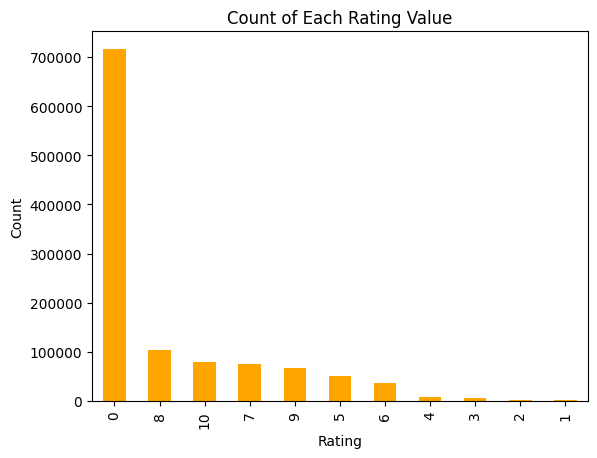

# Book Recommendation System Using Collaborative Filtering

An end-to-end Data Science project to build a Book Recommendation System using Collaborative Filtering with clustering deployed using Dockers, Github Action and Azure Web App.


## 1. Problem Statement
In the digital age, readers are faced with an overwhelming abundance of book choices, making it challenging to discover new titles that align with their interests and preferences. Traditional methods of book selection often rely on manual browsing, which can be time-consuming and inefficient. Furthermore, generic recommendations provided by online platforms may not cater to the unique tastes of individual readers, leading to a less satisfying reading experience. Consequently, there is a need for a more personalized, efficient, and user-friendly method of discovering books that aligns with individual reader's tastes and preferences.

## 2. Goal
The goal of this project is to develop a sophisticated book recommendation system using collaborative filtering and machine learning techniques. This system aims to:

**Deliver Personalized Recommendations:** Analyze user reading patterns and preferences to provide tailored book suggestions, enhancing the reading experience for each individual user.

**Streamline Book Discovery:** Utilize advanced algorithms to efficiently navigate the vast landscape of available books, thereby reducing the time and effort required for users to discover books that interest them.

**Increase Reader Engagement:** By offering relevant and appealing book recommendations, the system seeks to foster a more engaging and fulfilling reading journey, potentially increasing readership and time spent reading.

**Adapt to User Feedback:** Incorporate user feedback mechanisms to continuously refine and improve the accuracy and relevance of the recommendations.

**Accessible and User-Friendly Interface:** Develop an easy-to-use platform, possibly with a web-based interface, allowing users to seamlessly interact with the system and discover new books effortlessly.

## 3. Requirements & Constraints

### Functional Requirements:

**Personalization:** The system must analyze user behavior, preferences, and past ratings to suggest books tailored to individual tastes.

**User Interface:** An intuitive and responsive user interface, accessible across different devices (computers, tablets, smartphones).

**Data Handling:** Efficient management of large datasets, including book information, user profiles, and ratings.

**Search and Filter:** Advanced search functionality with filters based on genre, author, publication year, etc.

### Non-Functional Requirements:

**Performance:** High responsiveness with minimal latency in delivering book recommendations.

**Reliability:** Consistent and accurate book recommendations with minimal downtime.

### Technical Requirements:

**Technology Stack:** Appropriate selection of programming languages, frameworks, and libraries.

**Machine Learning Algorithms:** Implementation of collaborative filtering and other relevant algorithms.

**Quality of Data:** The accuracy and relevance of recommendations heavily depend on the quality of data, including user ratings and book information.

**User Engagement:** The system relies on active user participation in rating and reviewing books for better personalization, which might not always be consistent.

**Algorithm Complexity:** Balancing the complexity of algorithms with system performance and scalability.

**Resource Limitations:** Budget constraints may limit the extent of features, technology stack, and scalability solutions.

### Out-of-scope
- Integrating with external applications or data sources.
- Providing detailed equipment diagnostic information.

## 4. Data Description
The dataset used in this project is provided by Kaggle. Although, it contains three different files `books.csv`, `ratings.csv` and `users.csv` files with almost 271360 records based on 8 different features. Some of the import features in the dataset are `ISBN`, `Book-Title`, `Book-Author`, `Publisher` and `Image-URL-L`. The dataset is publicly available and can be downloaded here at [Kaggle](https://www.kaggle.com/datasets/saurabhbagchi/books-dataset/data). 

Some of the important properties from the dataset is shown below.

   
 
   
  

## 5. Data Preprocessing:
The followings steps are taken to preprocess the data for modelling. 

### Data Loading

**Books Data:** Loaded from a CSV file (books.csv) using Pandas. The file includes columns such as ISBN, book title, author, year of publication, publisher, and image URLs.

**Users Data:** Loaded from another CSV file (users.csv), containing user-related information like user IDs, locations, and ages.
Ratings Data: Loaded from a third CSV file (ratings.csv), which includes user IDs, ISBNs of the books, and the corresponding ratings.

### Data Cleaning and Transformation

**Renaming Columns:** In both the books and ratings data, columns were renamed for better readability and consistency. For example, 'Book-Title' was renamed to 'title', 'Book-Author' to 'author', etc.

**Handling Missing Values:** Although not explicitly shown in the provided code, handling missing values (like NaNs in age or ratings) is a typical preprocessing step.

**Filtering Users:** Users who have given fewer than 200 ratings were filtered out. This step likely aims to focus on more active users to improve the quality of the recommendations.

### Data Merging

**Merging Ratings with Books Data:** The ratings data was merged with the books data on the 'ISBN' field. This step is crucial for consolidating user ratings with corresponding book details.

### Creating a Pivot Table

**User-Book Matrix:** A pivot table was created using the merged dataset to form a user-book matrix. In this matrix, rows represent book titles, columns represent user IDs, and the values are the ratings. Missing ratings were filled with 0, which is a standard approach in collaborative filtering.

### Handling Sparse Data

**Sparse Matrix Creation:** A sparse matrix representation of the user-book matrix was created using csr_matrix from Scipy. This step is significant in handling the sparsity of data efficiently, which is common in recommendation systems where not all users have rated all books.

## 6. Methodology
 

The MLOps (Machine Learning Operations) pipeline project is designed to create an end-to-end workflow for developing and deploying a web application that performs data preprocessing, model training, model evaluation, and prediction. The pipeline leverages Docker containers for encapsulating code, artifacts, and both the frontend and backend components of the application. The application is deployed using GitHub Action for CI/CD and Azure Web APP services.

The pipeline follows the following sequence of steps:

1. **Data Ingestion** - Ingest the data into the feature store and divide the data into train and test dataset.
2. **Data Preprocessing** - Treat missing values, feature engineering.
3. **Model Building** - Build a baseline model and compare several models to compare the model performance. Select final model based on performance metric. Final model is selected based on the K neighbours, model training time.


4. **Steamlit Application** Based web appilication to make inferences. 


5. **CI/CD Pipeline** - The pipeline is automated using GitHub Actions, which allows for continuous integration and deployment of the application. This automation ensures that the application is always up-to-date and provides a consistent experience for users.


6. **Deployement** - Deployed using Azure web App Services.


## 7. Usage Instructions

To run locally, please following steps
### Clone the github repo
```
git clone https://github.com/Bhardwaj-Saurabh/book-recommendation-system-using-collaborative-filtering.git
``` 

### Change current directory
```
cd book-recommendation-system-using-collaborative-filtering
``` 

### Create virtual enviornment
```
python3 -m venv venv
source venv/bin/activate (for MacOS)
``` 

### Install necessary libraries
```
pip install -r requirements.txt
``` 

### Run the application locally
```
streamlit run app.py
``` 

 

To build using dockers:

**Prerequisites**
Ensure Docker is installed on the user's system. Docker is available for Windows, macOS, and Linux. Users can download it from Docker's official website.
Steps to Run the Project Using Docker

### Pull the Docker Image
```
docker pull aryansaurabhbhardwaj/bookrecommendationsystem:new
```

### Run the Docker Container
```
docker run -p localport:containerport aryansaurabhbhardwaj/bookrecommendationsystem:tagname
```

## 8. Conclusion

In this project, the primary objective was to develop a sophisticated book recommendation system that leverages collaborative filtering and machine learning techniques. The goal was to personalize book suggestions for users based on their reading preferences and habits. A comprehensive Exploratory Data Analysis (EDA) was conducted to understand the intricacies and characteristics of the data. Following the insights gained from the EDA, various data preprocessing steps and model experiments were undertaken.

Subsequently, based on selected performance metrics, an optimal model was chosen for the recommendation system. The final step involved deploying a web application, which serves as an interface for users to interact with and benefit from the recommendation system. The complete pipeline, encompassing various machine learning components, was successfully deployed and made operational.

The most significant challenge encountered in this project was addressing the sparsity of the data, typical in user-item interaction datasets. The challenge was amplified by the need to balance the accuracy of recommendations with computational efficiency. To mitigate this, advanced techniques such as matrix factorization and dimensionality reduction were utilized, which, however, led to a trade-off between system complexity and recommendation quality.

To enhance the system's performance and user experience, the following steps can be considered for future improvements:

**Improving Personalization:** Refine the recommendation algorithms to better capture individual user preferences, possibly by integrating more sophisticated machine learning models or deep learning techniques.

**Enhancing Data Quality:** Further cleansing and enrichment of the dataset, potentially by incorporating additional user and book metadata, to provide more context for the recommendations.

Working on this project can be a comprehensive learning experience, strengthening your capabilities in handling real-world data, applying machine learning techniques, and deploying a functional application.

## 12. Licence, Author, & Acknowldgement

[MIT Licence](LICENSE)

**Acknowledgements**

This competition is hosted on Kaggle by the user Old Monk.
Special thanks to ineuron.ai for the guidance on this project.

**Data Source:**

The dataset is publicly available at [Kaggle](https://kaggle.com/). 
Old Monk (Owner) -  Kaggle. 

**Author:** Saurabh Bhardwaj

**Contact:** [LinkedIn](https://www.linkedin.com/in/saurabhbhardwajofficial)
